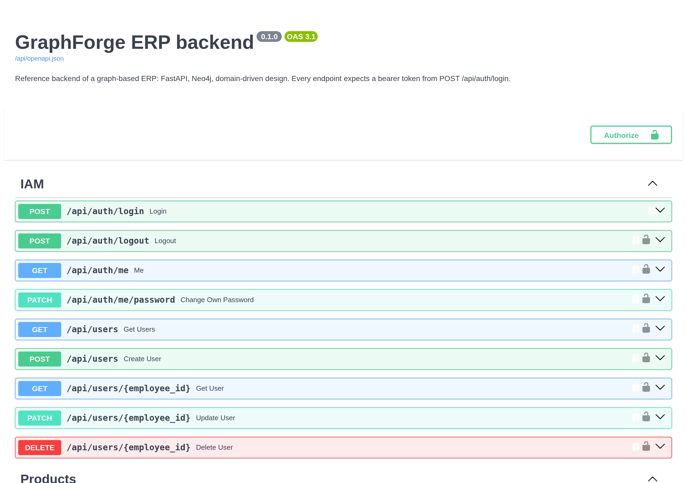
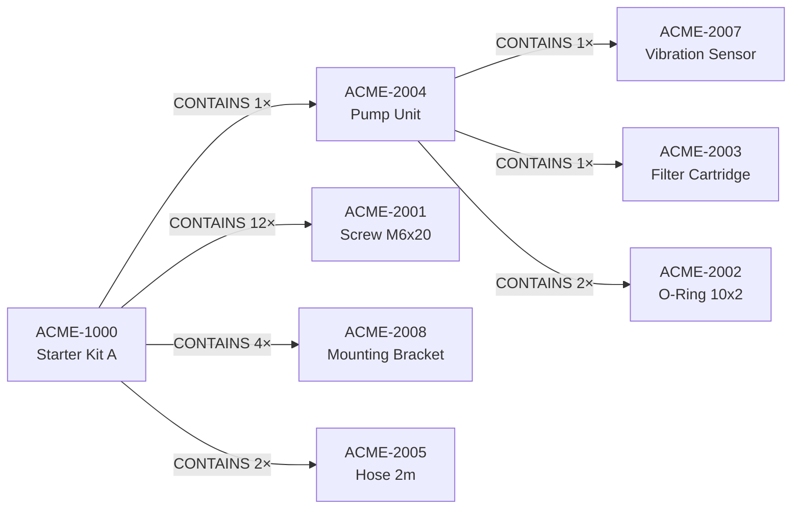
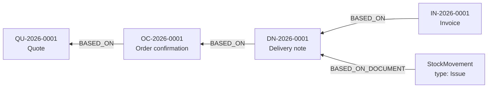

# GraphForge ERP — a graph-based ERP backend


The backend of a small ERP system, built with **FastAPI** on **Neo4j** and organised by domain.
It covers the full flow of a manufacturing business: products with recursive bills of materials, stock derived from its own movement history, documents from quote to invoice, purchasing with reorder suggestions, serialised assets with a digital twin and a service forecast, and role-based notifications pushed over WebSocket.

**65 REST endpoints · 8 domains · 1,290+ tests — 820 without a database, 470 against a real Neo4j.**

The requirements come from day-to-day work in a real manufacturing business; this public version is reduced to its core and anonymised.
The data is invented. The architecture is not.



---

## Highlights

- **A graph where the domain is a graph.** Bills of materials, document chains and asset structures are resolved in a single Cypher traversal, not in N round trips through an ORM or recursive SQL CTEs.
- **Stock you can prove.** Stock levels are a cache over an append-only movement history, and every domain books through one single function. That keeps `quantity = f(movements)` provable, and the integration tests check it after every booking.
- **Business rules in one place.** A delivery note issues stock; an invoice behind it does not. Rules like this one are small pure functions in a module of their own, so they can be read and tested without the Cypher around them; the document chain that applies them — partial deliveries, cancellations, follow-ups — sits right beside it.
- **Two separate kinds of authorisation.** Role gates decide *who may call* an endpoint; field masking decides *what they get to see*. Purchasing sees purchase prices and margins; Sales, calling the same endpoint, does not.
- **Designed for concurrent writes.** Existence checks run in the same transaction as the write, and uniqueness is left to database constraints rather than checked beforehand — which removes the two usual sources of check-then-act races.
- **Strict layering.** Router → service → repository in every domain. There is no Cypher outside a repository and no `session.run()` outside the query helpers.
- **Tests on three levels.** Unit and API tests need no database and run in about twenty seconds; integration tests run every repository against a real Neo4j started by Testcontainers. CI runs both suites in parallel jobs.

---

## The graph in two pictures

Both diagrams show the demo data exactly as [`seed.cypher`](seed.cypher) creates it.

### A bill of materials

A product contains other products, which can contain products again — `CONTAINS` is a self-reference of any depth, with the quantity on the edge.



When a machine is built from this kit, a single query flattens the tree to its leaves and multiplies the quantities along each path.
That parts list becomes the machine's digital twin.

### A document chain

Every document points back at the one it came from.
The delivery note is the one that moves goods, so the stock movement hangs off it — the invoice behind it books nothing.



`BASED_ON` is deliberately not one-to-one: an invoice over two partial deliveries points at two delivery notes.
The full model, with every label, relationship and constraint, is in [docs/data-model.md](docs/data-model.md).

---

## Quick start

```bash
cp .env.example .env                        # set a password and a JWT secret
docker compose up -d                        # neo4j + backend
docker compose --profile seed up seed       # once: demo data
```

Then open **http://localhost:8000/api/docs** and sign in with `max.mustermann@acme.example` and the password `demo1234`.

➡️ The full guide — running without Docker, all six demo accounts and their roles, the test commands — is in **[docs/getting-started.md](docs/getting-started.md)**.
How to put a public demo online is described in [docs/deployment.md](docs/deployment.md).

---

## Architecture

```
        HTTP / WebSocket
              │
        router_*.py       route, status code, role gate, field masking
              │
        service_*.py      business logic, logging, events — no Cypher
              │
      repository_*.py     Cypher, transactions, conversion into the read model
              │
            Neo4j
```

There is one folder per domain, and each follows the same layout of four files plus tests:

```
backend/domains/<domain>/
├── router_<domain>.py        HTTP endpoints
├── service_<domain>.py       business logic
├── repository_<domain>.py    Cypher queries
├── schemas_<domain>.py       Pydantic models
└── test_*.py                 unit tests, next to the code they cover
```

`sales` is the one exception: its repository is a package with one module per aggregate, because the document chain alone is larger than any other domain's repository.

| Domain | Responsibility |
| --- | --- |
| `iam` | Login, JWT, user accounts and roles |
| `catalog` | Products, product groups, bills of materials |
| `inventory` | Locations, stock levels, stock movements |
| `procurement` | Suppliers, their products, reorder suggestions |
| `sales` | Customers, contracts, pricing, reports, and the document chain from quote to invoice (goods receipts included) |
| `assets` | Serialised assets, digital twin, releases, service forecast |
| `notifications` | Role-addressed notification list, annual service run |
| `realtime` | WebSocket push |

`core/` holds what all of them share: configuration, the database driver, security, field visibility, exception handling and logging.

---

## A guided tour of the code

If you are here to read rather than to run, these are the places where the interesting decisions are:

| Where | What it shows |
| --- | --- |
| [`sales/repository_sales/rules.py`](backend/domains/sales/repository_sales/rules.py) | The truth tables of the document chain: which document books what, and which counter a cancellation corrects |
| [`sales/repository_sales/documents.py`](backend/domains/sales/repository_sales/documents.py) | The document chain itself: bookings in the same transaction as the document, partial deliveries, cancellations |
| [`inventory/repository_inventory.py`](backend/domains/inventory/repository_inventory.py) | Stock as a cache over the movement history, with one booking function for everything |
| [`catalog/repository_catalog.py`](backend/domains/catalog/repository_catalog.py) | A bill-of-materials tree of any depth in one round trip, and a cycle guard that is a path query rather than a check beforehand |
| [`assets/repository_assets.py`](backend/domains/assets/repository_assets.py) | A status that is derived rather than stored, and the flat bill-of-materials copy: leaves only, quantities multiplied along the path |
| [`core/visibility.py`](backend/core/visibility.py) | Role-based field masking |
| [`core/exceptions.py`](backend/core/exceptions.py) | Four business exceptions, four status codes, one error shape |

Every module explains in its docstring why it is shaped the way it is.
The documents below cover what a docstring cannot:

| Document | Contents |
| --- | --- |
| [docs/architecture.md](docs/architecture.md) | Layers, conventions and the deliberate decisions — including what they cost |
| [docs/data-model.md](docs/data-model.md) | Every node label, relationship, property and constraint, with its business reason |
| [docs/getting-started.md](docs/getting-started.md) | Setup, demo accounts, test commands |
| [docs/deployment.md](docs/deployment.md) | A free public demo on Render and Neo4j Aura |
| [backend/README.md](backend/README.md) | Backend overview: code tour, layer rules, test levels, technology choices |

---

## Testing

Tests are split into three levels, according to what each one replaces:

- **Unit tests** sit next to the code they cover. They test pure functions directly, and repositories against an intercepted query, which checks parameter binding and result conversion.
- **API tests** in `backend/tests/api/` send real HTTP requests through the real app. Middleware, routing, validation, role dependencies and exception handlers all run; only the service layer is mocked.
- **Integration tests** in `backend/tests/integration/` run the repositories against a real Neo4j that [Testcontainers](https://testcontainers.com) starts once per run, with the schema from `seed.cypher` and an empty graph for every test.

The first two levels prove everything except one thing: whether a Cypher query returns the right rows.
That is what the integration tests are for — the document chain from quote to invoice, partial deliveries and cancellations, the goods receipt control, releases and their reservations, the bill-of-materials copy and the service forecast.
Throughout, they check that stock and movement history still agree after every booking, and that a rejected operation leaves nothing behind.

[CI](.github/workflows/ci.yml) runs lint, type checking, unit and API tests in one job and the integration tests in a second one, in parallel.

---

## Tech stack

| | |
| --- | --- |
| **FastAPI** | Routing, validation and OpenAPI generated from the same type annotations |
| **Neo4j 5** (async driver, no OGM) | Native graph traversal for BOMs, document chains and asset structures |
| **Pydantic v2** | Tolerant read models against the graph, strict write models at the boundary |
| **PyJWT + bcrypt** | Bearer tokens and hashed passwords |
| **loguru** | Structured logging with a `request_id` that is carried through the whole call chain |
| **pytest · ruff · pyright** | Tests, linting and type checking, each configured explicitly |
| **uv · Docker Compose · GitHub Actions** | Dependencies, local stack, CI |

---

## Deliberate simplifications

Some things are simpler than they would be in production, and the code says so where it matters.
Money is stored as integer cents.
The annual service list is produced when it is requested rather than by a scheduler.
WebSocket connections are held in the memory of a single process, which is why the container runs one worker.

---

## Licence

[Apache License 2.0](LICENSE).
