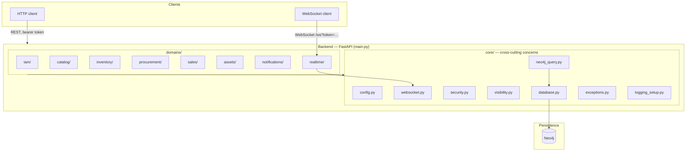

# Architecture of the backend

This document describes the structure of the backend and the decisions behind it. It is the reference for the question *where does which code belong, and why is it shaped this way* — the data model itself lives in [data-model.md](data-model.md).

## 1. Overview

A FastAPI backend talking to a graph database over the native asynchronous Neo4j driver. It follows a domain-driven, vertical-slice architecture with a strict separation of layers inside every domain.

- **Guiding principle: a thick backend.** Recursive bills of materials, document chains and asset structures are resolved server-side in Cypher and handed over as finished JSON. A client that had to assemble a bill of materials from several requests would hold half the business rules itself.
- **No object graph mapper.** An OGM produces an N+1 problem on exactly the queries this project exists for: resolving a bill of materials of unknown depth means one round trip per node, while native traversal does it in one. Every read model is therefore built from a Cypher map projection, not from an object graph.

## 2. System overview



## 3. Architecture principles

| Principle | Description |
|---|---|
| Domain-driven design | Code is cut along business functions (`catalog`, `sales`, …), not along technical layers. That keeps what belongs together in one folder and reduces the number of files a change touches. |
| Separation of concerns | Every file of a domain has exactly one responsibility: router = HTTP, service = logic, repository = database, schemas = contract. |
| Clean architecture | Dependencies run strictly inwards: router → service → repository. A router never talks to the database. |
| Dependency injection | The Neo4j session is injected into the router through `Depends(get_db_session)` and handed down from there. |
| Managed transactions | Repositories reach Neo4j exclusively through the helpers in `core/neo4j_query.py` (`read_single`, `read_many`, `write_single`, `write_many`, `write_summary`), never through an auto-commit `session.run()`. That wraps every query in `session.execute_read`/`execute_write`, so a transient failure is retried by the driver instead of surfacing as a 500. |
| A three-level test strategy | Unit tests colocated with the code they cover (no database, no HTTP), API tests in `tests/api/` that send a real request through the real app, and integration tests in `tests/integration/` that run the Cypher against a real Neo4j. |
| Central error handling | Services raise business exceptions; `core/exceptions.py` translates them into HTTP responses in one place. |

> **A deliberate exception to “separation of concerns”.** Checks that read the stored state sit in the repository, not in the service — the existence of a parent product and the absence of a cycle when adding a bill-of-materials component, the withdrawal of a release after shipping, the stock check before a release reserves. All of them run inside the same `execute_write` transaction function as the write itself. A separate check in the service would run in a transaction of its own and could be undercut between check and write by a concurrent request (TOCTOU). The rule is therefore not “no logic in the repository” but “whatever has to be atomic with the write belongs in the write's transaction”.

## 4. Project structure

```
backend/
├── .env.example
├── .gitignore
├── .dockerignore
├── Dockerfile
├── pyproject.toml
├── uv.lock
├── main.py
├── core/
│   ├── config.py
│   ├── database.py
│   ├── neo4j_query.py
│   ├── neo4j_types.py
│   ├── schemas.py
│   ├── security.py
│   ├── visibility.py
│   ├── websocket.py
│   ├── exceptions.py
│   ├── logging_setup.py
│   └── test_*.py
├── domains/
│   ├── catalog/
│   │   ├── router_catalog.py
│   │   ├── schemas_catalog.py
│   │   ├── service_catalog.py
│   │   ├── repository_catalog.py
│   │   └── test_*.py
│   ├── iam/            # identical structure
│   ├── inventory/      # identical structure
│   ├── procurement/    # identical structure
│   ├── sales/          # same files, but repository_sales/ is a package — see 5.3
│   ├── assets/         # identical structure
│   ├── notifications/  # identical structure
│   └── realtime/
│       └── router_realtime.py   # WebSocket endpoint only
└── tests/
    ├── conftest.py
    ├── api/            # HTTP tests, service layer mocked
    └── integration/    # repositories against a real Neo4j in Testcontainers
```

There is no `requirements.txt` — the project uses `uv` with `pyproject.toml` and `uv.lock` for a deterministic resolution, and the Dockerfile installs with `--locked` so a build cannot silently resolve differently from the one that was tested.

## 5. Components and responsibilities

### 5.1 `core/` — the technical foundation

Cross-cutting concerns, each in one file:

- **`config.py`** — loads the environment type-safely through `pydantic-settings`; `get_settings()` is `@lru_cache`d, so the file is read once per process.
- **`database.py`** — a singleton for the asynchronous driver and `get_db_session()` as a FastAPI dependency. One driver per process: it holds a connection pool, and a second one would double the connections without buying anything.
- **`neo4j_query.py`** — the central helpers every repository runs its Cypher through. The only place the transaction-function pattern is implemented.
- **`neo4j_types.py`** — two annotated types that let a Pydantic model accept the driver's `neo4j.time.Date`/`DateTime` directly. Neither is a subclass of the Python type, so without this every read model would reject what the driver hands it.
- **`schemas.py`** — `InputModel` (`extra="forbid"`) and `ErrorResponse`, the two contracts every domain shares.
- **`security.py`** — JWT creation and validation, password hashing, and the role dependencies `get_current_user` and `require_any_role`.
- **`visibility.py`** — role-based visibility of individual response fields, deliberately separate from `security.py`; see section 10.9.
- **`websocket.py`** — the connection manager and the event contract.
- **`exceptions.py`** — the four business exceptions and the global handlers that turn them into HTTP responses.
- **`logging_setup.py`** — `configure_logging()`, which sets up the console sink and optionally a file sink, steered by `LOG_LEVEL`, `LOG_FILE` and `DEBUG`.

### 5.2 `domains/` — the bounded contexts

| Domain | What it owns |
|---|---|
| `iam` | Authentication, employees, roles |
| `catalog` | Products, recursive bills of materials, the range hierarchy |
| `inventory` | Locations, stock levels, the movement history |
| `procurement` | Suppliers, supply ranges, reorder suggestions |
| `sales` | Customers, the document chain, contracts, price calculation, the revenue report |
| `assets` | The digital twin of the machines at the customer's site, releases, the service forecast |
| `notifications` | The tickable, role-addressed notification list |
| `realtime` | The WebSocket endpoint — a bounded context of its own, so the push path is one file |

### 5.3 File conventions inside a domain

| File | Purpose | Allowed | Forbidden |
|---|---|---|---|
| `router_<domain>.py` | Takes the request, validates the input, gates on roles, masks fields. | `@router.get`, `Depends()`, status codes, field masking | Cypher, business logic, `try/except` for business errors |
| `schemas_<domain>.py` | The Pydantic contract for request and response. | Pydantic models, validators | API logic, database access |
| `service_<domain>.py` | The brain of the domain: business rules, logging, events. | Business rules, business exceptions, pure functions | HTTP details, response objects, Cypher |
| `repository_<domain>.py` | Cypher and transactions, and the conversion into the read model. | `MATCH`, `MERGE`, `CREATE`, the helpers from `core/neo4j_query.py`, transaction functions | Business logic\*, `session.run()` |
| `test_*.py` | Unit tests of the file next to them. | `monkeypatch`, `AsyncMock`, intercepted queries | Real database calls |

\* Except the state-reading checks named in section 3.

The one exception to the one-file layout is `repository_sales`: it is a package with one module per aggregate (`customers`, `documents`, `contracts`, `pricing`, `reports`) plus the pure `rules`, because the document chain alone outgrew what one file can carry readably.
The package re-exports its repositories, so the service imports them the same way as in every other domain.

## 6. Data flow and lifecycle

### 6.1 The path of a request

1. The **router** validates the payload through Pydantic, checks the role and hands the validated model on. Where the permission depends on the body rather than on the endpoint — the document type decides who may create it — the check sits in the router as a plain function call, because the type is only known after the body has been parsed.
2. The **service** applies the business rules, raises a business exception on a violation, writes the log line and sends the WebSocket event. It knows no HTTP.
3. The **repository** runs the Cypher through the managed-transaction helpers and converts the result into a Pydantic model. A multi-step read-then-write runs atomically in one transaction function.
4. A raised exception is turned into a status code by the global handler, without the router taking part.

### 6.2 The application lifecycle

`main.py` verifies the database connection in the lifespan (`verify_connectivity()`) and closes the driver cleanly on shutdown. The check belongs there and not into the first request: a wrong URI or a wrong password is a configuration error, and it should surface on startup rather than as a 500 on whichever endpoint someone happens to call first.

Routers are registered manually and explicitly with `app.include_router(...)` — no magic imports and no dynamic loading. The list can be read top to bottom and says which domains the application is assembled from; a router missing from it is invisible, and a domain whose tests all pass can still be unreachable.

### 6.3 The request id

A middleware assigns an eight-character `request_id` per request and puts it in two places: into `request.state` for the exception handlers, which get the request object, and into a `contextvar` through `logger.contextualize()` for the service layer, which does not. All three levels — middleware, handler, service — therefore carry the same id for the same request, and the id leaves the building in the `X-Request-ID` header so a client-side report can be tied to the server log lines of exactly that call.

## 7. The API surface

65 operations across 47 paths plus the WebSocket endpoint. The full list with every schema is served by the application itself at `/api/docs`.

| Prefix | Domain | What it covers |
|---|---|---|
| `/api/auth`, `/api/users` | iam | Sign-in, own profile, user administration |
| `/api/products`, `/api/product-groups` | catalog | Products, bills of materials, the range hierarchy |
| `/api/locations`, `/api/stock`, `/api/stock-movements` | inventory | Locations, stock, the movement history |
| `/api/suppliers`, `/api/reorder-suggestions` | procurement | Suppliers, supply ranges, the reorder analysis |
| `/api/customers`, `/api/documents`, `/api/contracts`, `/api/pricing`, `/api/reports` | sales | Customers, the document chain, contracts, price calculation, revenue |
| `/api/assets` | assets | Assets, releases, drafts, the service forecast |
| `/api/notifications` | notifications | The notification list, the annual run |
| `/ws` | realtime | The event push |
| `/` | — | The health check, the only endpoint without a token |

The three documentation paths sit under `/api` (`/api/docs`, `/api/redoc`, `/api/openapi.json`) rather than at the root. Behind a reverse proxy only `/api` reaches the backend, so under the default paths the interface would be unreachable — the call would land at whatever serves the root.

## 8. Real-time communication

- **Endpoint:** `/ws`, in the `realtime` domain.
- **Authentication:** a JWT as the query parameter `?token=…`. A browser cannot send an `Authorization` header on a WebSocket connection, so the query parameter is the standard-conforming alternative.
- **The token is checked before `accept()`.** Accepting first and closing afterwards would register a client in the manager that never had a right to be there, and the next broadcast would reach it. The consequence is visible on the wire: because the socket is closed before the handshake completes, the client sees an **HTTP 403** and never the close code 4008 the endpoint asks for. That is the price of never handing out an open socket, and it is the half of the trade worth paying.
- **The server is the single source.** The receive loop only waits for the disconnect; a frame arriving from a client is discarded rather than passed on. A client able to push into this socket would be an unauthenticated write path past every router.

Every event follows one contract:

```json
{"type": "event", "entity": "document", "trigger": "document_created",
 "reference": "QU-2026-0001", "ids": ["QU-2026-0001"], "scope": "list"}
```

`reference` names what the operation acted on, `ids` what changed because of it. Above 200 ids `ids_and_scope()` drops the list and sends `scope: "many"` instead — a client then reloads its view wholesale rather than reconciling two hundred single hits.

A newly connecting client receives **no state** with the handshake. It loads its view over REST, where the permission check applies anyway; pushing state into the socket would be a second read path with its own visibility rules.

## 9. Error handling

Routers follow a happy path. Services raise plain Python exceptions, and `core/exceptions.py` maps them:

| Exception | Status | Raised when |
|---|---|---|
| `NotFoundError` | 404 | The addressed object does not exist |
| `DuplicateKeyError` | 409 | A uniqueness constraint fired |
| `BusinessLogicError` | 400 | A business rule refuses the operation |
| `DatabaseError` | 500 | The graph holds data a read model cannot map, or a query failed |

Two handlers FastAPI brings along are deliberately overridden, because they answer `detail` instead of `message` — on a 422 even a list of objects rather than a text. Without that override every client would have to know three answer shapes, and one rendering `detail` raw would put JSON on the screen.

Two details of the 422 handler are load-bearing:

- **The field name survives, the value never does.** Pydantic puts the offending value into every error object. On a sign-in that value is the submitted password — it would end up in the response, in a browser log and in every tool that records error responses.
- **An unknown key is named.** Because every input model forbids extras, the answer can say exactly which key the client sent too many (see 10.2).

The 500 is the one case where the message is not passed on: it would carry the Cypher text and the parameter values to the client.

## 10. Data conventions

### 10.1 Money

Money is stored as **integers in cents**, recognisable by the property suffix `Cent`. The API works in **euro as a `Decimal`**, and the conversion happens exclusively at the repository boundary. A field holding money without the suffix is a bug: `costPrice: 176` is indistinguishable from 176 euro.

The driver rejects a `Decimal` as a query parameter outright, so the conversion has to happen somewhere. Doing it in one place per direction is what keeps two domains from rounding differently — and `_euro` quantises to two decimals so a list view and a detail view of the same document cannot disagree in the last cent.

> **In Cypher always `round()` before `toInteger()`:** `toInteger(8.2 * 100)` yields `819` instead of `820`, because 8.2 has no exact binary representation. In Python the problem does not arise as long as the calculation stays in `Decimal`.

### 10.2 Read and write models

Pydantic schemas are split by direction:

- **Read models** (`Product`, `Document`, `Asset`) carry **no value constraints** and have, apart from the identifying fields, only optional ones. A constraint on a read model protects nothing — it merely turns an already stored database state into an HTTP 500. A graph that grew over time holds incomplete nodes, and that is not an error the reader gets to have an opinion about.
- **Write models** (`ProductCreate`, `ProductUpdate`) validate strictly. They sit at the system boundary, which is where validation has an effect.

**Every schema taking a request body inherits from `InputModel`** (`core/schemas.py`). The class carries not a single field, only `model_config = ConfigDict(extra="forbid")`: an unknown key in the body produces a 422 that names it, instead of being dropped silently.

The reason is a concrete class of bug. A client sending `isWearpart` where the graph holds `isWearPart` would have its field discarded without a word — the value would be lost on every save and come back as `undefined` on every load, with no error anywhere. Forbidding extras turns that into a message naming the typo.

**Why a base class rather than a repeated line of configuration:** one line per schema would have the same effect, but a schema added later can forget it. A derivation cannot be forgotten — a write model inheriting from `BaseModel` stands out in review. It is no breach of the substitution principle either: unlike a shared field base, `InputModel` changes not a single field type.

**Read models deliberately do not inherit from it.** They map a graph in which nodes carry properties no current schema knows about.

**Write models do not inherit from the read model.** `ProductCreate` and `ProductUpdate` declare their fields independently although they overlap heavily. The reason is again the substitution principle: a derivation tightening an inherited `str | None` to `str` is no longer a subtype — Pydantic carries it at runtime, a type checker rejects it rightly. Keeping the inheritance and silencing the report would have been the worse trade, because the rule that catches it catches real errors elsewhere. The price of independence is a handful of repeated field lines.

**Consequence for maintenance:** a new field in `ProductBase` does **not** automatically land in the write models. Whether it is needed on creation or on change is a separate decision every time. Exactly that was wanted for `active`: it belongs in `ProductUpdate`, not in `ProductCreate`, because a newly created product is active by definition.

### 10.3 Product classification

Every `Product` carries exactly one of the labels `:Assembly` or `:Part`, derived from the `CONTAINS` structure. The structure is the truth, not a flag carried beside it.

The invariant holds at runtime in **both** directions:

- `create_product` sets `:Part` — a new product has no bill of materials yet.
- `add_component` replaces it on the parent with `:Assembly`.
- `delete_component` turns that back when the **last** component goes.

### 10.4 Calculated fields instead of stored ones

Four values the API delivers are calculated, not stored:

| Field | Derived from | Where |
|---|---|---|
| `Product.type` / `hasBom` | `EXISTS { (p)-[:CONTAINS]->() }` | `product_projection()` |
| `Asset.status` | `shippedOn`, `bomReleased` | `asset_projection()` |
| `Stock.available` | `quantity − reserved` | the stock projection |
| `Contract` validity | `validFrom`/`validTo` against today | the contract query |

The reasoning is the same in all four cases: a stored value can diverge from the parts it is made of, and a derived one cannot by construction. A stored `status` could read `planned` while `shippedOn` is set; a stored `active` flag on a contract would need a job to flip it, and until that job runs the value is wrong. The price is one edge check or one subtraction per row read, which runs inside the same round trip.

`Document.type` is the deliberate counter-example: it is stored **and** mirrored as a label. Redundant on purpose — the label lets a type-bound query use the index, and the property lets the answer name the type without a second lookup. Both are written in the same statement, so they cannot drift apart.

### 10.5 The map projection as the implementation pattern

Derived fields come about **in Cypher**, not in Python. Every reading query of a domain uses one shared projection, for example `product_projection()`:

```cypher
p{
    .*,
    type:   CASE WHEN EXISTS { (p)-[:CONTAINS]->() } THEN 'Assembly' ELSE 'Part' END,
    hasBom: EXISTS { (p)-[:CONTAINS]->() },
    active: coalesce(p.active, true),
    stockEffect: coalesce(p.stockEffect, 'direct'),
    subcategory: head([(p)-[:BELONGS_TO]->(s:Subcategory) | {id: s.id, name: s.name}]),
    suppliers:   [(sup:Supplier)-[sp:SUPPLIES_PRODUCT]->(p) | {supplierId: sup.id, …}]
}
```

Four properties make the pattern carry:

1. **One round trip.** The alternative — a second query per product for the edge check — is the N+1 problem this project avoids an OGM for.
2. **One dictionary.** The result has the same shape as a plain `RETURN p`, so the conversion function needs no second argument and no change at its call sites.
3. **The explicit key wins against `.*`.** A calculated `hasBom` structurally displaces a property of the same name: a future import cannot push one through without somebody changing Python.
4. **Pattern comprehensions instead of `OPTIONAL MATCH` + `collect()`.** A comprehension needs no `WITH`, which is what lets the projection be inserted as a pure expression into a query that already has one. It also yields `[]` by itself rather than one row per hit, and a `collect()` beside several `OPTIONAL MATCH` clauses has to group by every remaining variable — forget one and it vanishes from the result silently.

Two separate queries would also be two transactions: between “fetch the products” and “does this one have edges?” a concurrent request could change the bill of materials. The projection reads properties and edges in the same snapshot.

### 10.6 Uniqueness through the constraint, not through a check beforehand

Write paths do **not** ask whether a key is already taken. They run a `CREATE` and translate Neo4j's `ConstraintError` into a `DuplicateKeyError`, which the global handler turns into a 409.

A check beforehand would run in a transaction of its own and be stale the moment it takes effect — the same TOCTOU case as in section 3. The constraint checks at the moment of writing and cannot be undercut.

Two rules follow:

- **`CREATE`, not `MERGE`.** `MERGE` updates an existing node silently instead of reporting the collision; the stored record would be overwritten. Only `CREATE` trips the constraint.
- **The message names the colliding key.** Where a node carries several uniqueness constraints (`AssetInstance`: `serialNumber` *and* `internalNumber`), the answer has to say which one fired.

**The documented exception is idempotence.** Three paths want `MERGE` precisely because a repeat must not fail: a notification (the same annual run must not create a second row), a service completion (one anchor per component, no history), and a goods receipt (the same supplier delivery note answers with the first receipt instead of booking again). Each of them says so in its docstring — that is what makes it a justified exception rather than an asserted one.

### 10.7 Business keys instead of technical ids

No node gets a technical `id` beside its business key. It holds as a path parameter too:

| Node | Key | Path |
|---|---|---|
| `Product` | `number` | `/api/products/{number}` |
| `AssetInstance` | `serialNumber` | `/api/assets/{serialNumber}` |
| `Document` | `number` | `/api/documents/{number}` |
| `Notification` | `id` (a composed business key) | `/api/notifications/{id}` |

A second key for the same thing can diverge from the first, has to be assigned and maintained, and on every request somebody has to know which of the two is meant. With the asset there is a business argument on top: every machine at a customer's site carries a plate with exactly that serial number, and the technician on site reads it off — a technical id beside it would be worthless to them.

**A business key does not have to be consecutive, and mostly is not.** Three of them are, because their order carries meaning: a document number, a project number and a serial number are read, quoted and sometimes audited, and a gap in an invoice number is a question somebody has to answer. Every other key the server assigns is a uuid4 behind its prefix:

| Key | Shape | Counted? |
|---|---|---|
| `Document.number` | `QU-2026-0005`, `GR-2026-0002-2` | yes — printed, and the chain is built on it |
| `Order.projectNumber` | `2026-0004` | yes — the bracket over the whole chain |
| `AssetInstance.serialNumber` | `SN-2026-0004-2` | yes — stamped on a plate |
| `Customer.id` | `C-<uuid4>` | no |
| `Supplier.id` | `S-<uuid4>` | no |
| `Employee.id` | `E-<uuid4>` | no |
| `Contract.id` | `contract-<uuid4>` | no |
| `StockMovement.id` | `mov-<uuid4>` | no |

A supplier used to carry a display number beside its id, a consecutive `SUP-004` meant for the interface. Once the counter behind it became a uuid, the field said nothing the id did not already say, and it was removed — the rule at the top of this section applies to a second key of one's own making just as much as to an imported one.

A counter is not free: it has to read the previous maximum before every write and is stale the moment it writes. Two concurrent creations compute the same value, the constraint catches one of them, and the caller gets a 409 it can do nothing about except repeat the request. Where the business needs the order that is the right price — and the constraint stays the authority rather than a lock. Where it does not, the uuid removes the read and the race in one move.

Composed keys are used where they make a creation path idempotent on their own: `ComponentInstance.id` is `serialNumber_productNumber`, `DocumentLine.id` is `documentNumber_lineNumber`, and a notification id carries the case it came out of (`shortage_GR-2026-0001_2`).

### 10.8 The asset status

`AssetInstance` carries **no** `status` property. The value is derived from the fields that document the course anyway:

| Priority | Status | Condition |
|---|---|---|
| 1 | `shipped` | `shippedOn IS NOT NULL` |
| 2 | `released` | `coalesce(bomReleased, false)` |
| 3 | `planned` | otherwise |

**The ranking is required by the business rules, not cosmetic.** A shipped asset is always released as well, so both conditions apply — without the cascade the result would depend on the order of evaluation.

Implemented as a pair in `repository_assets.py`: `asset_projection()` delivers the value when reading, `status_condition()` translates the query filter. Both express the same ranking, and **every filter fragment actively excludes the higher-ranked cases** — otherwise `?status=released` would additionally return every asset already shipped. Filtering runs against the source fields rather than against the projected `status`, because a projected key is not yet available in the same query stage.

The value from the client selects a fragment; it is never written into the query text. An unknown status raises a `ValueError` rather than falling back silently — the system boundary rejects it with a 422 already, so reaching the repository means a programming error, and a silent fallback would turn it into an inconspicuously wrong result list.

**Consequence for the API:** `status` appears only in answers. There is no `PATCH` on it — the state changes through the business action (grant the release, set the shipping date), not through the label. A settable status field would be a second truth beside `shippedOn`.

> **The limit of the solution:** exactly three states are expressible. A fourth one such as “in production” could not be derived from any existing field and would need a stored property after all.

### 10.9 Role-based field visibility

Hiding a field is a different thing from blocking an endpoint. `core/security.py` decides who may call an endpoint at all; `core/visibility.py` decides which fields of an otherwise permitted answer stay visible. The functions are called in the router, after the service call and before the return — which is the only place that knows both the data and the caller.

| What is hidden | Visible to | Where |
|---|---|---|
| Cost price on a product | `Purchasing`, `BackOffice`, `Accounting`, `Engineering` | `router_catalog.py` |
| Amounts of a purchase order, per line and aggregated | `Purchasing` | `router_sales.py` |
| Cost and margin in the revenue report | `Purchasing` | `router_sales.py` |
| Contract discount rates and fixed prices | `BackOffice` | `router_sales.py` |

`Admin` passes every one of them, because `has_role` lets it through everywhere — otherwise the role would have to be added to each list separately.

A purchase order is at heart a list of purchase prices, so it is masked as a whole while every other document type keeps its amounts — those are sales prices, and sales works with them. The document itself stays readable either way: a 403 would hide that the document exists at all, which is more than the rule asks for.

> **The first row has a wider set than the other two, and the two are not defined in the same place.** `core/visibility.sees_cost_prices()` names `Purchasing` alone, while `router_catalog.py` carries its own list of four roles for the cost price on a product. The difference is defensible — a cost price in the product master is a planning figure that engineering and accounting work with, whereas the amounts of a concrete purchase order are a negotiation result — but it means one concept has two definitions. Whoever tightens one of them has to touch both; the honest fix would be a second function in `visibility.py` rather than a list in the router.

### 10.10 Stock movements

Five movement types with cleanly separated effects; `quantity` is a positive amount except on a correction and a transfer, where the sign itself carries the information. `StockLevel` keeps `quantity` and `reserved` apart, and `available` is the difference, calculated rather than stored.

The stock is a **cache over the movement history**, derived from it rather than carried forward independently. That keeps `quantity = f(movements)` provable no matter how a figure came about. A negative stock is impossible in the real world and is compensated by a traceable correction booking — not by silently overwriting the value.

Every domain books through one function (`post_movement`), which is also the single place the stock key and the movement id are formed. A second construction site would mean one domain forming the key differently and creating a second stock node beside the existing one.

On a capped reservation the movement records the **actual** difference, not the request. Otherwise the event would diverge from `reserved` and the invariant above would break at the first scarce booking.

### 10.11 Purchase prices

The purchase price is **not** product master data in the strict sense. It is negotiated per supplier, and that is where it sits:

| Place | Field | Meaning |
|---|---|---|
| Edge `SUPPLIES_PRODUCT` | `purchasePriceCent` | The negotiated price of this supplier |
| Node `StockMovement` | `purchasePriceCent` | What a particular receipt actually cost |
| Node `Product` | `costPriceCent` | The value the contribution margin is calculated from |

The margin in the revenue report follows an all-or-nothing rule: one line without a cost price makes the margin of the whole group `null` rather than understating it. A partially calculated margin is worse than none, because nobody can see which part is missing.

## 11. The data model

The complete node and relationship model, every property and every constraint — with the business reason for each — is in [data-model.md](data-model.md). The binding source is [`seed.cypher`](../seed.cypher), which creates the schema and a consistent demo data set.

Graph traversals (recursive bills of materials, document chains, asset structures) run in Cypher at database level, never as a loop over several round trips.

## 12. Infrastructure and deployment

- **Hosting:** the backend is containerised; the `Dockerfile` installs with `uv --locked`, runs as an unprivileged user and carries a health check against the root endpoint.
- **Database:** Neo4j runs as its own container in the same network.
- **Reverse proxy:** in a deployment a proxy sits in front and forwards only `/api` to the backend — which is why the documentation paths moved under that prefix (section 7).
- **One worker, deliberately.** `core/websocket.py` keeps the open connections in the memory of the process. With several workers two clients would land in different processes and never see each other's events. Scaling out would need a shared channel between the workers, and that is a piece of infrastructure this project does not buy.
- **CORS:** `allow_origins=["*"]` with `allow_credentials=False`.

The CORS setting looks like a building site at first glance, so the reasoning: in a deployment the application and the API sit **behind the same proxy and therefore on the same origin** — a client calls over relative paths and the browser sends no `Origin` header at all. What remains is one case: a client configured with an absolute API address, to run against a backend on another machine. Only that case needs the middleware, and there is no second domain the origins could be narrowed to.

What carries the setting is `allow_credentials=False`. Authentication runs over a bearer token in the `Authorization` header, not over cookies. A foreign page may ask, but it does not hold the token — so every protected endpoint answers it with a 401. Dangerous would be the combination `"*"` **plus** credentials, and browsers refuse that one themselves.

## 13. Test strategy

Three levels, distinguished by **what they replace**. The commands are in [getting-started.md](getting-started.md#tests-lint-type-check).

| Level | Where | Replaces | Database |
|---|---|---|---|
| Unit | `core/`, `domains/*/test_*.py` | the repository (`monkeypatch`, `AsyncMock`) | no |
| API | `tests/api/` | the service layer and the database dependency | no |
| Integration | `tests/integration/` | nothing below the repository | a real Neo4j in a Testcontainers container |

**Unit tests** check business logic and conversion. That includes the **construction** of a query: the filter logic of a list endpoint is tested by intercepting `read_many` and inspecting the generated Cypher along with its parameters — without a database and in milliseconds. What is checked there is the parameter binding, not the wording, **except** where the wording carries a rule: that a search term is bound rather than inserted, that a business key is assembled from the parts that make it unique, that `completedAt` comes from `date()` and not from the request. Those places say so in the test docstring, so the next reader knows the assertion is deliberate rather than brittle.

**API tests** send a real HTTP request through the real app over `ASGITransport`: middleware, routing, Pydantic validation, the role dependencies and the global exception handlers all run; only the service layer is mocked. That is the level where a route order, a role gate and an answer shape can be proven — and the only level that can prove them, because none of the three is visible from inside a single layer.

Two details of the fixtures matter:

- **`ASGITransport` does not run the lifespan**, unlike `TestClient` as a context manager. A `with TestClient(app)` would start the lifespan and with it `verify_connectivity()`, and the tests would need a running database. The one file that does need `TestClient` — the WebSocket tests, because httpx has no counterpart for the protocol — therefore replaces the driver with one whose connectivity check does nothing, rather than building a second app object that would no longer prove the route is registered on the real one.
- **The dependency override is removed after every test.** `app.dependency_overrides` hangs off the global app object, and an entry left behind would leak into the next test and cause a failure whose cause lies elsewhere.

**What the first two levels cannot prove is whether a Cypher query returns the right rows.** That needs a database, and it is what the **integration tests** are for. Testcontainers starts `neo4j:5-community` once per run and applies the constraints and indexes from `seed.cypher`; every test then starts on an empty graph and builds exactly the data it needs through Cypher, not through the repositories of other domains — a test of the stock queries should not turn red because the product creation of the catalog changed. They cover the actual business paths: the document chain from quote to invoice, partial deliveries and the open quantities read from `FULFILS` edges, the cancellation variants and their reversals, the goods receipt control with all four delivery statuses, the release with its reservation and the withdrawal that gives it back, the flat bill-of-materials copy, the service forecast before and after a completion report — and, throughout, the invariant that stock and movement history agree.

The integration tests are deliberately a separate suite: `poe test` stays at a few seconds without Docker, and CI runs the two in parallel jobs. Without Docker the integration tests are skipped locally, but fail under `CI`, where a skipped suite would look like a passing one.

> **A green test proves nothing until it has been shown to go red on a real fault.** For the tests guarding a critical rule the counter-check belongs to the work: break the rule in the production code, run the test, put it back. That has uncovered an ineffective test more than once — the test data missed the one row of the truth table where the right and the wrong variant differ.
