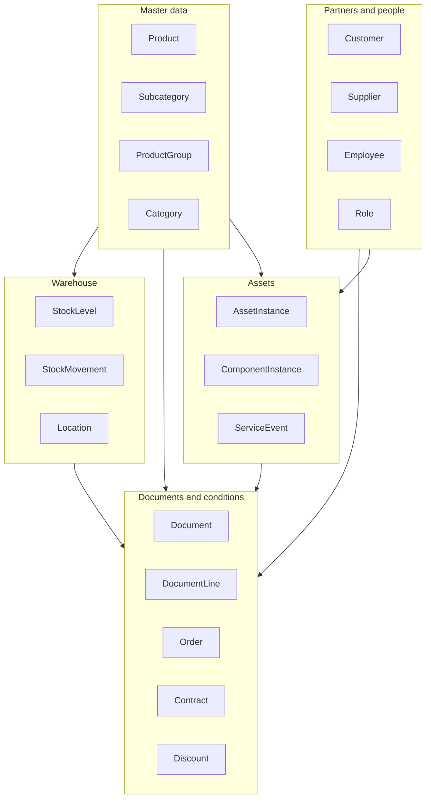
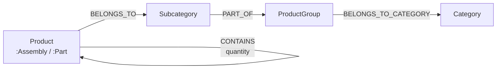
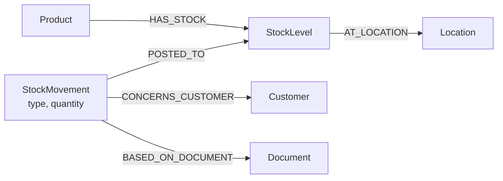
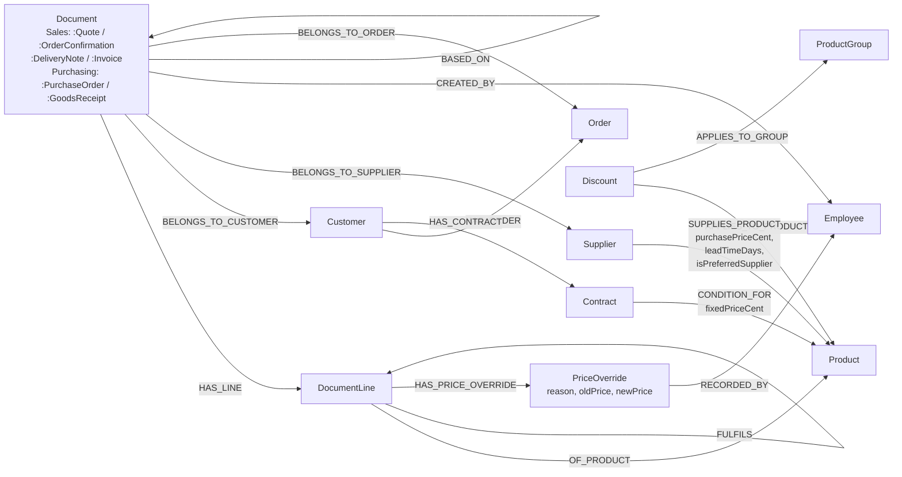
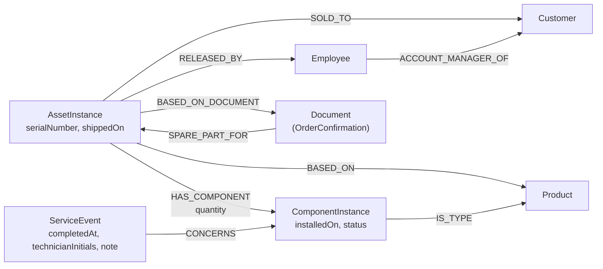
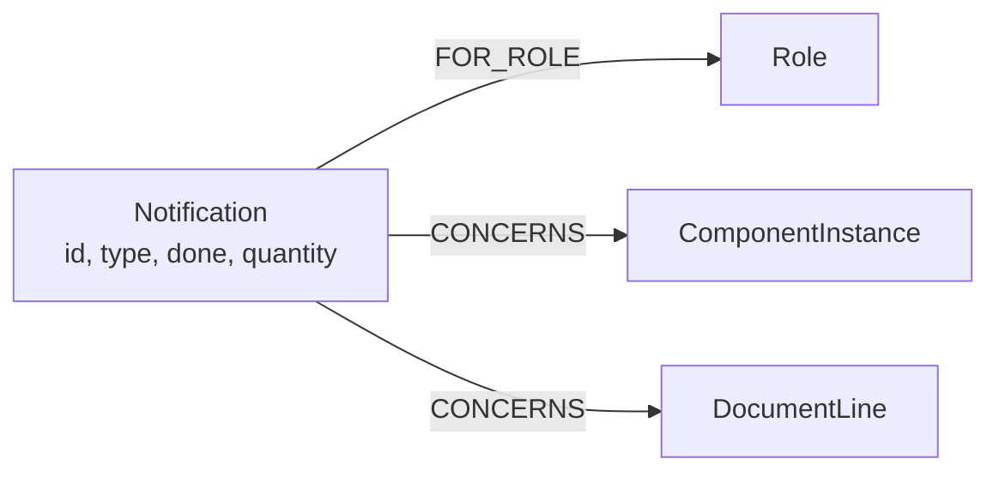

# The Neo4j data model

## 1. Purpose and scope

A binding description of the graph model: every node label, relationship type, property and constraint, each with the business reason for its existence.

**The source of truth is [`seed.cypher`](../seed.cypher).** This document describes what that file creates — it defines nothing on its own. Where the two disagree, the Cypher file wins.

The figures below were read off a freshly seeded instance, not estimated:

```bash
docker exec -i neo4j cypher-shell -u neo4j -p <password> < seed.cypher
```

**Scope:** 22 core node labels, 2 derived classification labels, 6 document subtype labels, 35 relationship types, 25 uniqueness constraints, 4 indexes.

> The number of relationship **types** does not grow because `BASED_ON_DOCUMENT` connects
> `StockMovement → Document` as well as `AssetInstance → Document`. The same type between a
> further pair of nodes is not a new type.

---

## 2. Conventions

### 2.1 Money

Integers in cents, recognisable by the property suffix `Cent` (`listPriceCent`, `costPriceCent`, `unitPriceCent`, `purchasePriceCent`). The API converts to a euro `Decimal` at the repository boundary and never anywhere else.

A field holding money **without** a `Cent` suffix is a bug. The exceptions are percentages, which are not amounts: `Discount.value`, `discountPercent`, `Contract.discountPercent`, `taxPercent`, `orderDiscountPercent`.

Why cents at all: a float cannot hold `0.10` exactly, and an ERP adds prices up thousands of times per report. The driver also rejects a `Decimal` as a query parameter outright, so the conversion has to happen somewhere — doing it in one place (`movement_params`, `_cent`, `_euro`) is what keeps two domains from rounding differently.

Rounding happens **before** the cast: `toInteger(8.2 * 100)` yields `819`, not `820`.

### 2.2 Product classification

Every `:Product` carries **exactly one** of the labels `:Assembly` or `:Part`, derived from the bill-of-materials structure:

```
(p)-[:CONTAINS]->()  exists  →  :Assembly
otherwise                    →  :Part
```

No `isAssembly` flag is stored. A flag can go stale when a bill of materials changes; the structure is the truth, and a derived rule cannot drift out of date in the first place.

The labels partition the product set completely and without overlap — in the seeded data set 13 products split into 10 `:Part` and 3 `:Assembly`, none without a label.

`ProductType` (`Part` | `Assembly`) is the API-visible value of the same distinction and is used as a query filter on `GET /api/products`.

### 2.3 Stock movements

Five movement types. `quantity` is always a **positive amount** except on a correction; the direction sits in the type.

| Type | acts on | direction | triggered by |
|---|---|---|---|
| `Receipt` | `quantity` | + | supplier delivery (goods receipt) |
| `Reservation` | `reserved` | + | order confirmation, bill-of-materials release |
| `Issue` | `quantity`, `reserved` | − | delivery note, invoice without a delivery note |
| `Correction` | `quantity` or `reserved` | ± | stocktaking, opening balance, reversal |
| `Transfer` | `quantity` | ± | move between two locations, booked as a pair |

`available` is **not stored**, it is calculated as `quantity − reserved`. A stored value could go stale against the parts it is made of.

**A `Reservation` is capped at what is available instead of being rejected.** Reserved is `min(requested, available)`; the unreserved remainder stays as an open quantity on the document line and shows up in the reorder suggestions. `Issue` and `Correction` by contrast check strictly and refuse to drive stock negative. The asymmetry is deliberate: an order confirmation should come about despite scarce stock, whereas issuing goods that are not there is not a state the warehouse can be in.

The bill-of-materials release (`PATCH /api/assets/{serialNumber}/release`) is the one reservation that does **not** want that capping — a half-reserved asset is no sensible intermediate state — and therefore checks all components together before booking any of them.

`StockLevel` is a snapshot cache over the booking history and is derived from the events in section 13.2 of the seed. The invariant `quantity = f(movements)` therefore stays provable at any time.

Negative balances are not overwritten but compensated by a traceable correction booking (section 13.4 of the seed), so the history still explains the number.

### 2.4 A note on `db.schema.nodeTypeProperties`

The procedure reports `NOT NULL` for properties throughout. That is **not a constraint**, it is the statement that the property was never `null` in the sample where it occurred. Beyond the uniqueness constraints of section 7 the database enforces no mandatory fields. The property tables below are therefore to be read as *observed*, not as *guaranteed* structure — which is also why every read model in the code is deliberately tolerant.

---

## 3. Diagrams

### 3.1 Overview



### 3.2 Master data and bill of materials



`CONTAINS` is a directed self-reference on `Product` and forms the recursive bill of materials.

The quantity belongs on the edge, not on the product: the same part sits in different assemblies in different numbers.

### 3.3 Warehouse



`StockLevel` is the cache per product-location pair, keyed `productNumber_locationId`;
`StockMovement` is the immutable event. Every domain books through one function
(`post_movement`), which is what keeps a second construction site from forming the stock key differently and creating a second stock node beside the existing one.

### 3.4 Documents, sales and conditions



`BASED_ON` chains the document sequence quote → order confirmation → delivery note → invoice. It is deliberately **not** 1:1: a document can carry several such edges, because an invoice over two partial deliveries points at two delivery notes.

`FULFILS` runs from the line of the new document to the line it settles — a goods receipt line to the purchase order line, an invoice line to the delivery note line. It is the basis of `deliveredQuantity`/`openQuantity`, which are summed from the incoming edges at read time rather than stored. A stored remaining quantity would be a second source for the same fact.

#### Order and order confirmation are not the same thing

The two are easily confused but live on different levels:

| | `:OrderConfirmation` | `:Order` |
|---|---|---|
| What | a **document type** — a label on a `:Document` node | a **node of its own** |
| Carries | number, date, language, status, lines | `projectNumber`, `year`, `deliveryDate` |
| How many per case | up to four documents (quote, confirmation, delivery note, invoice) | exactly one |

The order comes about **before** the confirmation in business terms: the customer's purchase creates the case, the confirmation acknowledges it. That is why **all four** sales documents get a `BELONGS_TO_ORDER` edge, not only the confirmation — they all carry the same project number, and the order is the bracket over the whole chain. Purchasing documents stay outside: they hang off the supplier and belong to no customer order.

There is no separate place that issues project numbers. `POST /api/documents` creates the
`Order` node itself for a sales document that arrives without one, in the same transaction as the document (`_create_order_in_tx`). The counter runs over the year, and it counts **both** sources — existing project numbers and the document numbers of that year — because a sales document of an order is numbered `{prefix}-{projectNumber}` while one without an order gets `{prefix}-{year}-{sequence}`. Both shapes land in the same slot, so counting only one side eventually collides with the uniqueness constraint on `Document.number`.

### 3.5 Assets and the digital twin



`ServiceEvent` is not part of the digital twin itself, it is the stored state of a completion report about it — see [“ServiceEvent — the state behind the completion report”](#serviceevent--the-state-behind-the-completion-report) below.

`BASED_ON` (to the product) and `BASED_ON_DOCUMENT` (to the document) are two different edges answering two different questions: *what kind of asset is this?* and *which order did it come out of?*

The chain `Employee → Customer ← AssetInstance → ComponentInstance → Product` carries the reminder function: from a wear part falling due there is an unbroken path to the responsible account manager.

#### When the bill of materials comes about

The flat bill of materials — all `HAS_COMPONENT` edges including `quantity` — comes about when the **asset is created**, not when it ships. Two paths write it, and they share one implementation (`_create_asset_in_tx`):

- **The draft flow.** An order confirmation with `assetPurpose == 'newAsset'` appears as an open draft (`GET /api/assets/drafts/assets`). Engineering confirms it and sends the bill of materials along, taken over from the document's lines and possibly adjusted (`_write_bom`). There is no catalogue product representing a whole asset, so there is nothing the backend could copy instead.
- **The manual route.** `POST /api/assets` with a `productNumber` copies the standard bill of materials of that product (`_copy_bom`): leaves over `CONTAINS*0..`, the quantity as the product of the edge quantities along the path, summed over all paths to the same leaf.

Shipping (`PATCH /api/assets/{serialNumber}` with `shippedOn`) does **not** create the bill of materials. It is only a fallback for an asset that carries no `HAS_COMPONENT` edge at all; for every asset created through one of the two paths above the shipping date is pure information.

`HAS_COMPONENT` covers **all** components of the bill of materials, not only wear parts — because the release (reservation) and the delivery note (issue) need every component, not only the service-relevant ones. The service forecast therefore filters on `isWearPart = true` itself.

Two releases must not be confused. `bomReleased` is act one: engineering releases the bill of materials for the workshop, and that reserves the components in the warehouse in the same transaction; a withdrawal books the reservation back. The acceptance of the finished machine at the customer's site is a different act and is **not** modelled — only `installedOn` marks the installation.

#### ServiceEvent — the state behind the completion report

The service forecast (`GET /api/assets/service`) is pure calculation without state of its own — but it has to be able to remember that a wear part was already replaced, otherwise the next replacement date would stand at the original `shippedOn` for ever. A slim node per component is enough for that: `ServiceEvent`, hung off the `ComponentInstance` over `CONCERNS`. No planning of its own, no history of several reports.

**The node is at the same time the anchor for the next cycle.**
`PUT /api/assets/service/{componentInstanceId}/completion` sets `ServiceEvent.completedAt` to
`date()`. The formula then switches from

```
replacementDueOn = shippedOn + serviceIntervalMonths
```

to

```
replacementDueOn = coalesce(ServiceEvent.completedAt, shippedOn) + serviceIntervalMonths
```

A row therefore disappears from the due list immediately after the report — the newly calculated date lies outside the thirty-day window — and comes back by itself once that date approaches. `MERGE (event:ServiceEvent {id: componentInstanceId})` makes a repeated report idempotent: there is deliberately only the one current anchor point, no history.

The interval runs from the **shipping date**, not from the installation date of the component: the service obligation starts at the point of sale. Assets without a shipping date drop out of the forecast rather than silently falling back to the installation date and reporting a wrong replacement date.

### 3.6 Notifications



One node type, three creation paths, and a tickable list per target role — no mail delivery and no scheduler:

| `type` | id | raised by | goes to |
|---|---|---|---|
| `service` | `service_{componentInstanceId}_{year}` | the annual run, triggered by the first list request of the year | `Sales` |
| `shortage` | `shortage_{goodsReceiptNumber}_{lineNumber}` | a goods receipt delivering less than ordered | `Purchasing` |
| `unavailable` | `unavailable_{documentNumber}_{lineNumber}` | `POST /api/notifications/unavailable` while picking | `Purchasing` |

The notification is addressed to a **role**, not to a person: whoever is on duty has to see it, and an employee-bound message would sit unread in the inbox of someone on holiday.

`CONCERNS` is reused rather than split into a second edge name for the same relationship idea — which of the two target nodes is meant follows from `Notification.type`.

A `shortage` stores **no quantity**. The ordered/received comparison is resolved at read time over the `FULFILS` edges, so a follow-up delivery booked afterwards changes the display text instead of freezing the state of the first booking. An `unavailable` does store its quantity, because that one is not derivable: it is a person's statement about what was within reach at their location at that moment.

---

## 4. Nodes

| Label | Key | Created by | Why the system needs it |
|---|---|---|---|
| `Product` | `number` | seed, `POST /api/products` | The central master record. Every other domain references it — stock, document line, bill of materials, asset. |
| `:Assembly` | — | derived (seed 13.1) | Classification for filters and as the entry point of a bill-of-materials traversal. Derived rather than stored, so it cannot diverge from the structure. |
| `:Part` | — | derived (seed 13.1) | The counterpart of `:Assembly`. The two labels partition the product set completely and without overlap. |
| `Category` | `id` | seed | Top level of the range. |
| `ProductGroup` | `id` | seed | The reference object of a group discount. |
| `Subcategory` | `id` | seed | Finest level of the range; a product hangs off exactly one. |
| `Customer` | `id` | seed, `POST /api/customers` | Revenue bearer. Carries the document, asset and contract references plus the account manager assignment the reminders run over. |
| `Employee` | `id` | seed, `POST /api/users` | Author of documents, releaser of a bill of materials, recipient of the role-addressed notifications. |
| `Role` | `name` | seed | The basis of the permission check. Not enforceable at database level in the community edition, hence a graph structure the backend evaluates. |
| `Supplier` | `id` | seed, `POST /api/suppliers` | Source of supply for the reorder suggestions. |
| `Document` | `number` | seed, `POST /api/documents` | The commercial core. |
| `:Quote` `:OrderConfirmation` `:DeliveryNote` `:Invoice` `:PurchaseOrder` `:GoodsReceipt` | — | set alongside `type` on creation | The document type as a label rather than only as a property, so type-bound queries can use the label index. The first four form the sales chain, the last two the purchasing side. |
| `DocumentLine` | `id` (`documentNumber_lineNumber`) | with its document | A **line on the document** (“3 × Starter Kit A”). A node of its own rather than an edge property, because it carries quantity, unit price, discount and the override marker. Those values belong to the line, not to the product — the same product can carry a different price on the next document. `lineNumber` is the key part, `sortOrder` a separate display field in steps of ten, which is what lets the same product appear more than once on a sales document. |
| `PriceOverride` | — | at runtime, when a line with `priceOverridden: true` is created | Records a manual price change. A node of its own rather than a property on the line, because the history has to be able to carry several changes and because it holds `oldPrice`, `reason` and the employee together. `oldPrice` is the list price of the product at the time of the change. |
| `Order` | `projectNumber` | `POST /api/documents` (see 3.4) | The project bracket over documents and assets. |
| `OrderLine` | `id` (`projectNumber_lineNumber`) | seed | The customer's order list — a different thing from a `DocumentLine`. The document carries “3 × ACME-1000” as **one** line; the order line records what that line consists of, as it stood at the time of the order. |
| `Location` | `id` | seed | Several locations (warehouse, service vans) are what make the really available stock per place determinable. |
| `StockLevel` | `id` (`productNumber_locationId`) | derived from the movements | Snapshot cache per product and place. Makes the stock query independent of the number of historical bookings. |
| `StockMovement` | `id` | seed, every booking path | The immutable event. Gapless traceability for stocktaking, purchasing and sales analysis. |
| `AssetInstance` | `serialNumber` | seed, `POST /api/assets`, draft confirmation | The physical machine at the customer's site. Carries the shipping and release data. |
| `ComponentInstance` | `id` (`serialNumber_productNumber`) | with the asset's bill of materials | The digital twin of an installed component, including the quantity needed per component. The key is built identically on every path, which is what keeps `MERGE` idempotent and a re-run free of duplicates. |
| `ServiceEvent` | `id` (= `ComponentInstance.id`) | `PUT /api/assets/service/{componentInstanceId}/completion` | The stored state of a completion report and at the same time the anchor for the next replacement cycle. See section 3.5. |
| `Notification` | `id` (business key per type) | the annual run, a goods receipt with a deviation, `POST /api/notifications/unavailable` | Three cases that differ in business terms, one node type: a persisted, tickable list per role. A business key instead of a technical one makes every creation path `MERGE`-idempotent — the same choice as on `ServiceEvent`. Separate from the WebSocket channel: this one is a list, not a broadcast. |
| `Contract` | `id` | seed, `POST /api/contracts` | Framework contract with a validity period, a flat discount rate and optionally product-specific fixed prices. The sole carrier of the customer discount axis. |
| `Discount` | `id` | seed | A time-limited discount at product or group level. |

---

## 5. Relationships

| Edge | from → to | Properties | Why the system needs it |
|---|---|---|---|
| `CONTAINS` | Product → Product | `quantity` | The recursive bill of materials of any depth, assembly-in-assembly included. The quantity belongs on the edge, because the same part sits in different assemblies in different numbers. |
| `BELONGS_TO` | Product → Subcategory | — | Range assignment, and the precondition of a group discount. |
| `PART_OF` | Subcategory → ProductGroup | — | Second level of the range hierarchy. |
| `BELONGS_TO_CATEGORY` | ProductGroup → Category | — | Top level of the range hierarchy. |
| `HAS_STOCK` | Product → StockLevel | — | Connects the master record with its stock per place. |
| `AT_LOCATION` | StockLevel → Location | — | The place the stock sits in. Without it the available stock per warehouse cannot be determined. |
| `POSTED_TO` | StockMovement → StockLevel | — | Links event and cache. The basis of the derivation `quantity = f(movements)`. |
| `CONCERNS_CUSTOMER` | StockMovement → Customer | — | Traceability **per customer**. |
| `BASED_ON_DOCUMENT` | StockMovement → Document | — | The document reference of a booking, and the basis of the line-level reversal on a cancellation. |
| `BASED_ON_DOCUMENT` | AssetInstance → Document | — | The order confirmation the asset came out of. Deliberately the same edge type as the row above: the statement is the same (“goes back to this document”), and a second name would inflate the vocabulary without distinguishing anything. |
| `HAS_LINE` | Document → DocumentLine | — | Document head to its lines. |
| `HAS_LINE` | Order → OrderLine | — | Order head to its lines. The same edge type again — the statement is the same, and the source nodes are distinguishable by their label. |
| `OF_PRODUCT` | DocumentLine → Product | — | The line's reference to the master record. |
| `OF_PRODUCT` | OrderLine → Product | — | The product ordered on that line. |
| `REQUIRES` | OrderLine → Product | `quantity` | The parts the ordered line consists of — the bill of materials as it stood at the time of the order. |
| `FULFILS` | DocumentLine → DocumentLine | — | Goods receipt line → purchase order line, invoice line → delivery note line. The basis of `deliveredQuantity`/`openQuantity` (the sum over all incoming edges, cancelled ones excluded) and of the ordered/received comparison. |
| `HAS_PRICE_OVERRIDE` | DocumentLine → PriceOverride | — | Only on lines with `priceOverridden: true`. |
| `RECORDED_BY` | PriceOverride → Employee | — | Who made the price change, taken from the auth token. An edge type of its own rather than `CREATED_BY`, because what is recorded here is a change, not a document. |
| `BELONGS_TO_CUSTOMER` | Document → Customer | — | The recipient of a sales document. |
| `BELONGS_TO_SUPPLIER` | Document → Supplier | — | The counterpart on the purchasing side. Purchase order and goods receipt hang off the supplier instead of a customer; without the edge the ordered/received comparison is not tied to a source of supply. |
| `CREATED_BY` | Document → Employee | — | Authorship, for traceability. |
| `BASED_ON` | Document → Document | — | The document chain quote → confirmation → delivery note → invoice. Not 1:1: a document can carry several of these edges (see 3.4). |
| `BASED_ON` | AssetInstance → Product | — | The product sold as the blueprint of the asset, and the entry point of the bill-of-materials copy. |
| `HAS_ORDER` | Customer → Order | — | The project reference. |
| `BELONGS_TO_ORDER` | Document → Order | — | The order is the bracket over the whole document chain. **Sales documents only** — purchase order and goods receipt belong to no customer order. |
| `SOLD_TO` | AssetInstance → Customer | — | The owner of the asset. Part of the path to the reminder function. |
| `HAS_COMPONENT` | AssetInstance → ComponentInstance | `quantity` | What is actually inside this machine (as-built state), including the number needed per component. Covers the whole bill of materials, not only the wear parts. |
| `IS_TYPE` | ComponentInstance → Product | — | Connects the concrete instance with the master record the service interval and the label come from. |
| `RELEASED_BY` | AssetInstance → Employee | — | The engineering release of the bill of materials. A formally relevant act, therefore recorded per person. |
| `SPARE_PART_FOR` | Document → AssetInstance | — | A spare-parts document linked to the assets it delivers for. Pure traceability: unlike a confirmed asset draft, no asset and no reservation come about. |
| `ACCOUNT_MANAGER_OF` | Employee → Customer | — | The assigned account manager. Direction employee → customer, the way the service query reads it. |
| `CONCERNS` | ServiceEvent → ComponentInstance | — | Links the stored completion report with the component it is about. |
| `CONCERNS` | Notification → ComponentInstance \| DocumentLine | — | Reused rather than given a second name for the same relationship idea — which of the two targets is meant follows from `Notification.type`. |
| `FOR_ROLE` | Notification → Role | — | Delivery to the role rather than to a single employee (see 3.6). |
| `HAS_ROLE` | Employee → Role | — | Permission assignment. |
| `HAS_CONTRACT` | Customer → Contract | — | A customer-specific framework agreement. |
| `CONDITION_FOR` | Contract → Product | `fixedPriceCent` | A product-specific fixed-price condition inside a contract. The condition sits on the edge, because it only comes about out of the combination of contract and product. `fixedPriceCent` is optional and forms the top level of the discount hierarchy — a fixed price beats the flat contract discount. |
| `APPLIES_TO_PRODUCT` | Discount → Product | — | A single-product discount. |
| `APPLIES_TO_GROUP` | Discount → ProductGroup | — | A group discount. |
| `SUPPLIES_PRODUCT` | Supplier → Product | `purchasePriceCent`, `leadTimeDays`, `isPreferredSupplier` | The supply range. The conditions sit on the edge, because the same product is available from several suppliers at different prices and lead times. |

---

## 6. Properties per node

Observed structure from a seeded instance. Not every property is set on every node of the same label — see the note in section 2.4.

### Product

| Property | Type | Meaning |
|---|---|---|
| `number` | String | The unique key |
| `label` | String | Display name |
| `shortText`, `description` | String | Additional texts |
| `shortTextEn` | String | English translation of `shortText`, used when a document is printed in English |
| `unit` | String | Unit of measure. `pcs` is the one value the whole-number rule applies to |
| `listPriceCent` | Integer | Sales price in cents |
| `costPriceCent` | Integer | Purchase price in cents. The basis of the contribution margin in the revenue report, and visible only to the roles allowed to see cost prices |
| `laborRateCent` | Integer | The labour share of the price, for services |
| `minStock`, `targetStock` | Integer | Stock bounds for the reorder analysis. `minStock` is the trigger, `targetStock` the target the suggestion fills up to |
| `serviceIntervalMonths` | Integer | The service interval of a wear part, in months |
| `isWearPart` | Boolean | Filters the service forecast in addition to `serviceIntervalMonths IS NOT NULL`, because `HAS_COMPONENT` covers the whole bill of materials. Does **not** steer whether a digital twin comes about at all |
| `stockEffect` | String (`direct` / `billOfMaterials` / `none`, default `direct` through `coalesce`) | Steers per document line what happens in the warehouse: an ordinary stock item is booked one to one; `billOfMaterials` books the components instead and lets an order confirmation become an asset; `none` (labour, flat fees) books nothing at all |
| `active` | Boolean | Deactivation instead of deletion — a product on a historical document must not vanish |
| `assemblyDeductsComponents`, `assemblyPrintsComponents`, `assemblyPriceFromComponents` | Boolean | Assembly behaviour: whether the components are deducted from stock, printed on the document, and whether the price comes from them or from the assembly itself |
| `usesSerialNumbers` | Boolean | Whether serial numbers are tracked for this product |
| `grossWeightKg`, `netWeightKg`, `taxPercent` | Float | Master data for shipping and invoicing |
| `gtin`, `manufacturerNumber` | String | Foreign keys into a barcode and a manufacturer catalogue |
| `commodityCode`, `countryOfOrigin` | String | For the invoice and for export |
| `discountable` | Boolean | Whether a discount may be granted on the product at all. Relevant to the discount hierarchy: a non-discountable product beats every candidate |

### StockLevel / StockMovement

| Node | Property | Type | Meaning |
|---|---|---|---|
| `StockLevel` | `id` | String | `productNumber_locationId` |
| | `quantity` | Float | Total stock, derived from the events |
| | `reserved` | Float | The bound quantity |
| `StockMovement` | `id` | String | The unique key, `mov-<uuid>` on every runtime booking |
| | `type` | String | One of the five movement types from section 2.3 |
| | `quantity` | Float | A positive amount, signed only on `Correction` and `Transfer`. On a capped reservation it records the **actual** difference, not the request — otherwise the event would diverge from `reserved` and the invariant would break |
| | `createdAt` | DateTime | The time of the booking, set server-side in UTC |
| | `documentNumber` | String | A reference, where the booking belongs to a document |
| | `purchasePriceCent` | Integer | Only on `Receipt` |
| | `note` | String | Free text, among other things the origin of a correction booking |

### AssetInstance / ComponentInstance / ServiceEvent / Notification

| Node | Property | Type | Meaning |
|---|---|---|---|
| `AssetInstance` | `serialNumber` | String | The business key, `SN-{projectNumber}[-n]`, formed server-side from the order behind the order confirmation. A second asset on the same order gets `-2`, a third `-3`. Once assigned it is never rewritten |
| | `internalNumber` | String | A second number assigned independently of the serial number. Optional, carries its own uniqueness constraint |
| | `projectNumber` | String | The project reference, taken over from the order |
| | `orderedOn` | Date | Taken over from the document date of the order confirmation |
| | `shippedOn` | Date | **The start of the service interval.** Setting it for the first time switches the status to `shipped` and cannot be taken back |
| | `installedOn` | Date | The installation at the customer's site. Carried over to the component instances. An asset that never shipped carries none |
| | `bomReleased` | Boolean | The engineering release. Can be missing on nodes that came about through `MERGE`, hence `coalesce` wherever it is read |
| | `releasedOn` | Date | The date of the release, `null` after a withdrawal |
| | `releaseNote` | String | The engineer's remark on the release. Only created through the release endpoint, and deleted by a withdrawal — which is why a note sent along with a withdrawal is rejected rather than silently dropped |
| `ComponentInstance` | `id` | String | `serialNumber_productNumber` |
| | `installedOn` | Date | When the part was installed |
| | `status` | String | `active` while installed |
| `ServiceEvent` | `id` | String | = `ComponentInstance.id`, set on the first report |
| | `completedAt` | Date | Set by the server (`date()`), never by the client — it doubles as the anchor of the next cycle, and a client able to claim it would move the next replacement date along |
| | `technicianInitials` | String | Optional, a pure display field — not checked against `Employee.initials` |
| | `note` | String | Optional free text on the completion |
| | `createdAt`, `updatedAt` | DateTime | Server-side, as in every other domain |
| `Notification` | `id` | String | The business key, its format depending on `type` — see 3.6 |
| | `type` | String | `service` \| `shortage` \| `unavailable` |
| | `done` | Boolean | The tick-off state |
| | `quantity` | Float | Only on `unavailable`: the quantity missing at the location |
| | `createdAt` | DateTime | Server-side, the time of creation |
| | `doneAt` | DateTime | Server-side, `null` while `done = false`. Overwritten on every repeated tick-off, not only on the first — ticking off again is an updated report of the same matter, not an error |

> **`serialNumber` and `internalNumber` are two different numbers.** Both carry their own
> uniqueness constraint (`asset_serialnumber`, `asset_internal`) and must not be equated. The
> API validates neither format, only uniqueness — and the constraint ignores a missing property, so an asset without an internal number stays admissible.

> **`AssetInstance` deliberately has no `status` property.** The API delivers `status` (`planned` | `released` | `shipped`) as a **calculated** field out of `shippedOn` and `bomReleased`. The derivation rule, its ranking and the reasoning are in [architecture.md](architecture.md), section “Calculated fields instead of stored ones”.
>
> Not to be confused with `ComponentInstance.status` in the row above — that one is a real, stored property with the value `active`.

### Document / DocumentLine / PriceOverride

| Node | Property | Type | Meaning |
|---|---|---|---|
| `Document` | `number` | String | The unique key. `{prefix}-{projectNumber}` for a sales document of an order, `{prefix}-{year}-{sequence}` without one, plus a counter for a follow-up document (`IN-2026-0005-2`) |
| | `type` | String | Redundant to the subtype label, for direct output |
| | `date` | Date | **The business document date** — it is printed on the document, is the basis of every period filter and fixes the applicable tax rate. On creation it is the day of creation and is deliberately **not** taken from the request. Not to be confused with `createdAt` |
| | `status` | String | `open`, `completed`, `cancelled`, `partiallyCancelled`, `partiallyDelivered`, `backorder`. A new document starts at `open`. A concluded document accepts a status change but no content change |
| | `language` | String | `DE` or `EN` — the interface stays in one language, the document goes to the customer in theirs |
| | `deliveryDate` | Date | The planned delivery date, mandatory on an order confirmation |
| | `orderDiscountPercent` | Float | A discount on the whole document, on top of the line discount. Lines with `hasFixedPrice` stay out of its basis |
| | `taxPercent` | Float | The tax rate **as of the document date**. It belongs on the document and not only on the product: the rate can change, and an invoice has to show the one that applied then |
| | `assetPurpose` | String | `newAsset` \| `spareParts`. Mandatory on a quote — sales has to say whether the case is about a new asset or about spare parts for an existing one, and a forgotten value would have to be guessed later |
| | `purchaseOrderNumber`, `deliveryNoteNumber` | String | Only on a `:GoodsReceipt`. Together they carry the composite constraint `goodsreceipt_note`, because a uniqueness constraint cannot check across an edge. It prevents the same supplier delivery note being booked twice against the same purchase order; a second attempt answers 200 with the first receipt instead of booking again |
| | `customerName`, `customerStreet`, `customerCity`, `customerCountry`, `customerVatId` | String | The recipient's address, **frozen on creation**. Read live off the `Customer` node, a customer moving house would retroactively change every invoice already issued. The projection reads `coalesce(d.customerName, c.name)` and falls back to the customer where a document carries no frozen value |
| | `createdAt`, `updatedAt` | DateTime | Server-side in UTC |
| `DocumentLine` | `id` | String | `documentNumber_lineNumber` — not `documentNumber_productNumber`, so the same product may appear more than once on a sales document |
| | `lineNumber` | Integer | The key part, assigned consecutively per document and stable afterwards |
| | `sortOrder` | Integer | The display order in steps of ten, independent of `lineNumber` — a line can be inserted between two others without renumbering anything |
| | `quantity` | Float | The line quantity. A product measured in `pcs` is rejected with a fractional value |
| | `unitPriceCent` | Integer | The price in cents |
| | `discountPercent` | Float | The line discount |
| | `priceOverridden` | Boolean | A manual price adjustment. Requires a `reason`, and the two are bound to each other in both directions by the schema |
| | `hasFixedPrice` | Boolean | A contractually fixed price. It beats the order discount and is therefore excluded from its basis |
| | `cancelled` | Boolean | The partial-cancellation marker. The line stays visible and drops out of the subtotal — a cancelled line is a documented event, not a mistake to be erased |
| | `reason` | String | The justification of the manual price change. Mandatory together with `priceOverridden` |
| `PriceOverride` | `reason` | String | The reason for the manual price change |
| | `oldPrice` | Integer | The list price of the product in cents, read at the time of the change |
| | `newPrice` | Integer | The manually set unit price of the line, in cents |
| | `createdAt` | DateTime | The time of recording, server-side in UTC |

### The remaining nodes

| Node | Properties |
|---|---|
| `Customer` | `id` (the customer number, `C-` plus a uuid4), `name`, `street`, `city`, `country`, `vatId`, `language` — plus `createdAt`/`updatedAt` |
| `Employee` | `id`, `name`, `email`, `initials`, `active`, `password` (a bcrypt hash including its salt) |
| `Role` | `name` |
| `Location` | `id`, `name`, `type` (`Warehouse` \| `Vehicle`) |
| `Supplier` | `id` (`S-` plus a uuid4), `name`, `email`, `phone`, `street`, `city`, `country`, `vatId` |
| `Contract` | `id`, `name`, `description`, `validFrom`, `validTo`, `isGlobal`, `discountPercent` |
| `Discount` | `id`, `type`, `value` (a percentage), `validFrom`, `validTo` |
| `Order` | `projectNumber`, `year`, `deliveryDate` |
| `OrderLine` | `id`, `lineNumber`, `shortText`, `quantity`, `status` |
| `Category`, `ProductGroup`, `Subcategory` | `id`, `name` |

> **`Employee.initials` is a login key, not a display field.** `POST /api/auth/login` takes a single `identifier` and looks it up as initials when it contains no `@`. Two employees sharing either value would make the login ambiguous, hence a uniqueness constraint on both. Employees without initials stay admissible — constraints ignore missing properties — and sign in with their e-mail address.

> **Which keys are counted and which are not.** Three numbers are consecutive, because a human reads them and their order carries meaning: `Document.number`, `Order.projectNumber` and `AssetInstance.serialNumber` — an invoice number with a gap is a question somebody has to answer, and a serial number is stamped on a plate. Everything else the server assigns is a uuid4 behind a prefix (`Customer.id`, `Supplier.id`, `Employee.id`, `Contract.id`, `StockMovement.id`).
>
> The reason is not taste. A counter has to read the previous maximum before every write and is stale the moment it writes: two concurrent creations compute the same value, and one of them fails on the constraint for a reason the caller can do nothing about except try again. Where the business does not need the order, that cost buys nothing. Where it does, the counter stays and the constraint remains the authority — `_create_order_in_tx` counts over both sources for exactly that reason (see 3.4).
>
> Nodes taken over from a predecessor system keep their short numbers (`C-1001`, `S-001`). Nothing counts over them any more, so nothing can collide with them either.
>
> A supplier used to carry a second, human-readable number beside its id. Once the counter behind it became a uuid, the field said nothing the id did not already say — two keys for one node, and somebody would have to know which of them a request means. It was removed along with its constraint; the seed drops that constraint explicitly, because one left behind would keep guarding a property nothing writes any more.

> **`Contract.isGlobal` decides who the contract applies to.** At `true` it applies to **every** customer — a campaign, not an individual agreement — and a `HAS_CONTRACT` edge must then not exist, which is why assigning a global contract to one customer is rejected.
> At `false` it applies exclusively to the customers linked to it. The price calculation has to check both cases, otherwise a global discount reaches nobody.

> **`Contract.active` does not exist** — it is calculated from `validFrom`/`validTo` against today's date. The same reasoning as with the asset status: a stored flag would need a job to flip it, and until that job runs the value is wrong.

---

## 7. Constraints and indexes

25 uniqueness constraints, each on the business key or on a uniquely identifying attribute:

| Node | Property | | Node | Property |
|---|---|---|---|---|
| `Product` | `number` | | `AssetInstance` | `serialNumber` |
| `Category` | `id` | | `AssetInstance` | `internalNumber` |
| `ProductGroup` | `id` | | `ComponentInstance` | `id` |
| `Subcategory` | `id` | | `ServiceEvent` | `id` |
| `Customer` | `id` | | `Notification` | `id` |
| `Supplier` | `id` | | `Contract` | `id` |
| `Supplier` | `id` | | `Discount` | `id` |
| `Employee` | `id` | | `Order` | `projectNumber` |
| `Employee` | `email` | | `OrderLine` | `id` |
| `Employee` | `initials` | | `Location` | `id` |
| `Role` | `name` | | `StockLevel` | `id` |
| `Document` | `number` | | `StockMovement` | `id` |
| `DocumentLine` | `id` | | `GoodsReceipt` | `(purchaseOrderNumber, deliveryNoteNumber)` composite |

The composite constraint is the only one in this model covering two properties rather than one; the reasoning sits with `Document.purchaseOrderNumber` in section 6. Neo4j community edition has no node key constraint, but a composite uniqueness constraint does the job here.

4 indexes, each for a filter that runs globally rather than through a key:

| Node | Property | Name | Technical reason |
|---|---|---|---|
| `Product` | `label` | `product_label` | Free-text search and auto-complete |
| `Document` | `type` | `document_type` | A frequent global filter (invoices versus delivery notes) |
| `StockMovement` | `type` | `movement_type` | A frequent global filter (receipts versus issues) |
| `Assembly` | `number` | `assembly_number` | The anchor node of a recursive bill-of-materials traversal |

Uniqueness constraints create an index implicitly in Neo4j, so every key access above is index-backed without a further entry.

---

## 8. What the model has to carry

Evidence that the model bears the requirements, each with the endpoint that exercises it.

| Requirement | How the model solves it | Endpoint |
|---|---|---|
| Tree structure, assemblies and sub-assemblies | `CONTAINS` as a directed self-reference on `Product`, traversed over `[:CONTAINS*]` at any depth | `GET /api/products/{number}/bom` |
| Documents as the commercial core | `Document` with six subtype labels, `DocumentLine` as a node of its own | `POST /api/documents` |
| A different warehouse effect per document type | Five movement types; a reservation acts on `reserved`, an issue on both fields, a quote books nothing | `POST /api/documents` |
| Several locations, the really available stock | `StockLevel` per product-location pair, `available` calculated as `quantity − reserved` | `GET /api/stock/{productNumber}` |
| A gapless history per customer | `StockMovement` as an immutable event, `CONCERNS_CUSTOMER` for the customer reference | `GET /api/stock-movements` |
| Component tracking for service | `ComponentInstance` per installed component with its `installedOn` | `GET /api/assets/{serialNumber}` |
| A service interval running from the point of sale | `AssetInstance.shippedOn` as the start, `Product.serviceIntervalMonths` as the duration | `GET /api/assets/service` |
| Notifying the responsible account manager | The unbroken path `Employee -[:ACCOUNT_MANAGER_OF]-> Customer <-[:SOLD_TO]- AssetInstance -[:HAS_COMPONENT]-> ComponentInstance` | `GET /api/assets/service` |
| A completion report with a state that persists | `ServiceEvent` per component over `CONCERNS`, `completedAt` doubling as the anchor of the next cycle | `PUT /api/assets/service/{id}/completion` |
| The engineering release of a bill of materials | `bomReleased`, `releasedOn`, `RELEASED_BY` — and the reservation that comes with it | `PATCH /api/assets/{serialNumber}/release` |
| Documents in German or English | `Document.language`, `Product.shortTextEn` | `POST /api/documents` |
| A document chain with a lock | `BASED_ON` between documents; the chain additionally decides whether an invoice still books, and a document with a successor is locked | `POST /api/documents` |
| Product, group and customer discounts | `Discount` with `APPLIES_TO_PRODUCT`/`APPLIES_TO_GROUP`, time-limited; `Contract` with `CONDITION_FOR`/`HAS_CONTRACT` | `POST /api/pricing/calculate` |
| Manual price adjustment with a reason | `DocumentLine.priceOverridden` plus a `PriceOverride` node holding the old price and the employee | `POST /api/documents` |
| Purchase prices at product level | `costPriceCent` on the product **and** `purchasePriceCent` on the receipt event | `GET /api/reports/revenue` |
| Roles and permissions | `Role` with `HAS_ROLE`, enforced in the backend because the community edition knows no field-level permissions | every endpoint |
| Reorder suggestions with a preferred supplier | `SUPPLIES_PRODUCT` with `isPreferredSupplier` and `purchasePriceCent`, `minStock`/`targetStock` on the product | `GET /api/reorder-suggestions` |
| The ordered/received comparison | The document types `PurchaseOrder` and `GoodsReceipt`, `FULFILS` between their lines, `BELONGS_TO_SUPPLIER` to the source | `POST /api/documents/{number}/goods-receipt` |
| A tickable notification list per role | `Notification` with `FOR_ROLE` and `CONCERNS`, a business key per case | `GET /api/notifications` |

### Cycles in a bill of materials

The schema itself does not prevent cycles — `CONTAINS` is an ordinary directed self-reference. The check happens on write: `BomRepository.add_component` verifies the existence of the parent product and the absence of a cycle inside **one** `execute_write` transaction.

Merging check and write is deliberate. A separate check beforehand would run in a transaction of its own and could be undercut between check and write by a concurrent request (TOCTOU).

### Performance

`StockLevel` as a snapshot cache keeps the stock query independent of the number of historical bookings — without it every query would have to aggregate the whole movement history.

The bill-of-materials resolution uses native graph traversal instead of recursive joins, and the `:Assembly` classification lets it start from the label index rather than from a full scan.

---

## 9. Deliberate simplifications

Named openly, so they are not mistaken for modelling errors.

**The cost price is a single value, not a moving average.** `costPriceCent` on the product is what the contribution margin in the revenue report is calculated from. `StockMovement.purchasePriceCent` records what a particular receipt actually cost, so a moving average remains derivable — but nothing derives it yet. The all-or-nothing rule stays: one line without a cost price makes the margin of the whole group `null` rather than understating it.

**`usesSerialNumbers` is imported but not evaluated.** The asset side tracks serial numbers through `AssetInstance`, and the flag on the product is not what steers it.

**`OrderLine` and `REQUIRES` are read-only.** They hold what an order consisted of at the time it was placed, and no endpoint writes them — the seed fills them so that the difference from a `DocumentLine` is visible in the data rather than only in this document.

**The tax rate is a single value per document.** A document with lines at different rates cannot be expressed. That is a real restriction, and it is a conscious one: it would need a rate per line and a subtotal per rate, and neither is interesting about the architecture this project is here to show.

**There is no scheduler.** The annual service list comes about from the first reading request of the year (`GET /api/notifications`), which is why that endpoint occasionally writes. The trade is a deliberate one — a piece of infrastructure against a side effect that is idempotent and documented.
